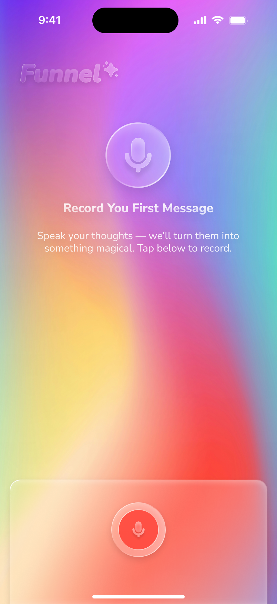
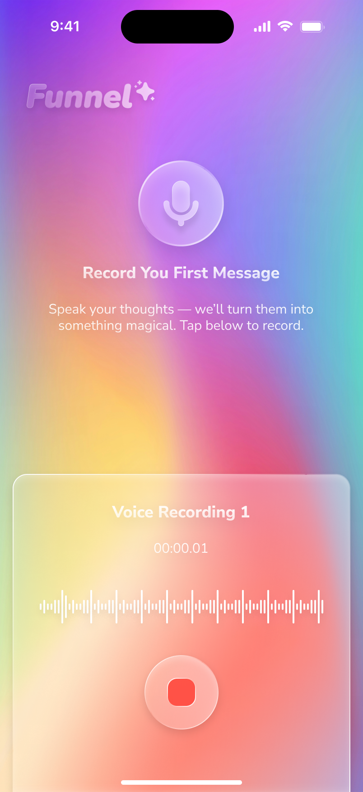
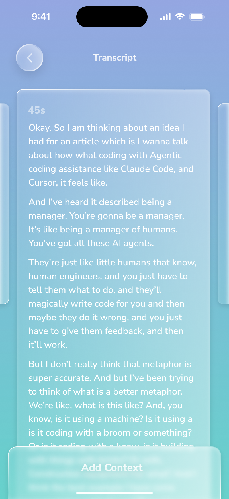

# Funnel 🎙️

Transform your stream-of-consciousness audio recordings into structured, actionable insights.

<div align="center">
  
  
  
</div>

## Overview

Funnel is a SwiftUI app that captures spontaneous audio recordings and transforms them into multiple visual representations. Perfect for capturing ideas on-the-go when inspiration strikes.

```
    🎤 Record → 🤖 Process → 📋 Visualize
         │            │             │
         │            │             ├── Bullet Points
         │            │             ├── Napkin Sketch
         │            │             └── Full Transcript
         │            │
         │            └── AI-powered transcription & summarization
         │
         └── One-tap recording with AirPods support
```

## Features

### 🎙️ Audio Recording
- Simple one-tap recording with real-time waveform visualization
- Background recording capability
- AirPods/headphone support
- Minimum duration check to ensure quality

### 🤖 AI Processing
- Automatic transcription via OpenAI Whisper
- Smart summarization using Anthropic Claude
- Visual diagram generation
- Fast processing with status updates

### 📱 Beautiful UI
- Gradient backgrounds with vibrant colors
- Glassmorphic effects for modern aesthetics
- Smooth animations and transitions
- Dark mode optimized

### 🗂️ Note Management
- Chronological list of all recordings
- Search across transcripts and summaries
- Export options (coming soon)
- Archive and delete functionality

## Tech Stack

### iOS App
- **SwiftUI** - Modern declarative UI
- **SwiftData** - Local persistence
- **AVAudioRecorder** - Audio capture
- **Combine** - Reactive programming

### Backend
- **Deno** - Modern TypeScript runtime
- **OpenAI Whisper API** - Audio transcription
- **Anthropic Claude API** - Content analysis
- **RESTful API** - Clean communication

## Getting Started

### Prerequisites
- Xcode 15+
- iOS 17+
- Deno 1.40+
- API Keys for OpenAI and Anthropic

### Installation

1. **Clone the repository**
   ```bash
   git clone https://github.com/happybits/funnel.git
   cd funnel
   ```

2. **Set up the iOS app**
   ```bash
   make install  # Install swiftformat
   make build    # Build the app
   ```

3. **Configure the backend**
   ```bash
   cd server
   cp .env.example .env
   # Add your API keys to .env
   ```

4. **Start the server**
   ```bash
   deno task dev
   ```

5. **Run the app**
   ```bash
   make run  # Or open in Xcode and run
   ```

## Development

### Available Commands

```bash
make help       # Show all available commands
make build      # Build the app
make run        # Run on simulator
make format     # Format Swift code
make test       # Run tests
make clean      # Clean build artifacts
```

### Project Structure

```
funnel/
├── Funnel/                 # iOS app
│   ├── Views/             # SwiftUI views
│   ├── Models/            # Data models
│   ├── Services/          # API and recording services
│   └── Utils/             # Helpers and extensions
├── server/                # Deno backend
│   ├── routes/           # API endpoints
│   ├── services/         # External API integrations
│   └── tests/            # Server tests
└── docs/                  # Documentation
```

## API Reference

### POST /api/new-recording
Upload an audio file for processing.

**Request:**
- Multipart form data with audio file
- Supported formats: mp3, mp4, wav, m4a

**Response:**
```json
{
  "transcript": "Full transcription text...",
  "duration": 45.2,
  "bulletSummary": ["Key point 1", "Key point 2"],
  "diagram": {
    "title": "Concept Overview",
    "description": "Visual representation of the main idea",
    "content": "ASCII art or mermaid diagram"
  }
}
```

## Contributing

We welcome contributions! Please see our [Contributing Guide](CONTRIBUTING.md) for details.

### Development Best Practices
- Follow the [SwiftUI Layout Best Practices](docs/swiftui-layout-best-practices.md)
- Review the [Glassmorphism Implementation Guide](docs/glassmorphism-implementation-guide.md) for performance tips
- The project uses Xcode's new folder-based structure (files are automatically referenced)
- Run `make format` before committing
- Write tests for new features

## License

MIT License - see [LICENSE](LICENSE) for details.

## Acknowledgments

- Design inspiration from modern iOS apps
- Built with ❤️ using SwiftUI and Deno
- Powered by OpenAI and Anthropic APIs

---

<div align="center">
  <strong>Turn your thoughts into action.</strong>
</div>