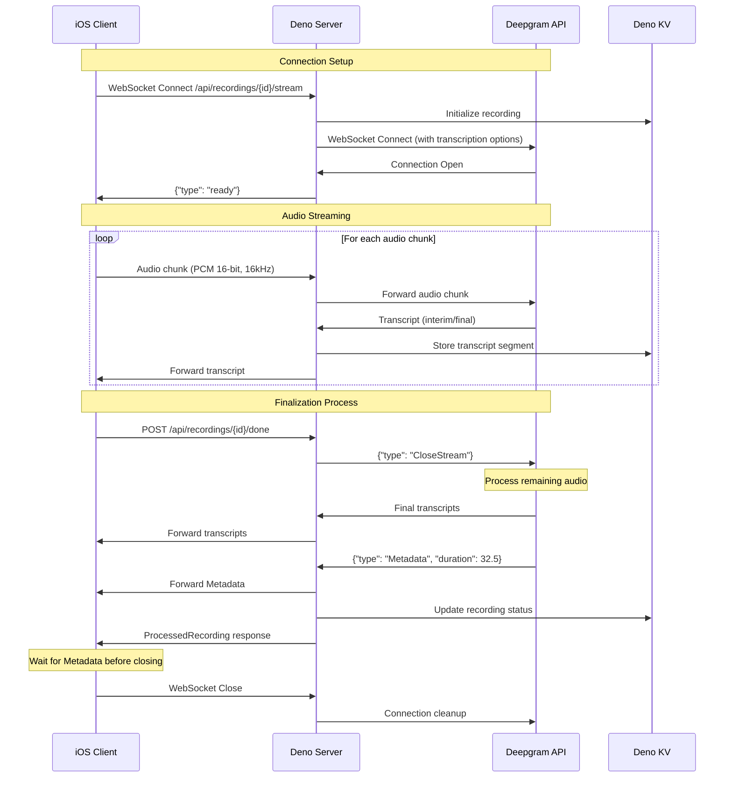

# Deepgram Integration Sequence Diagram

## Key Points Illustrated

1. **Parallel Communication**: The server forwards transcripts to the client while still receiving audio
2. **Finalization Trigger**: The client initiates finalization via REST endpoint, not WebSocket
3. **CloseStream Flow**: Server sends CloseStream and waits for Metadata confirmation
4. **Client Patience**: Client waits for Metadata before closing WebSocket
5. **Complete Transcript**: The ProcessedRecording includes all segments received before Metadata

## Timing Considerations

- Audio streaming: ~100ms between chunks
- Transcript latency: ~500ms from audio to transcript
- Finalization: Can take several seconds depending on buffered audio
- Metadata response: Arrives after all transcripts are sent